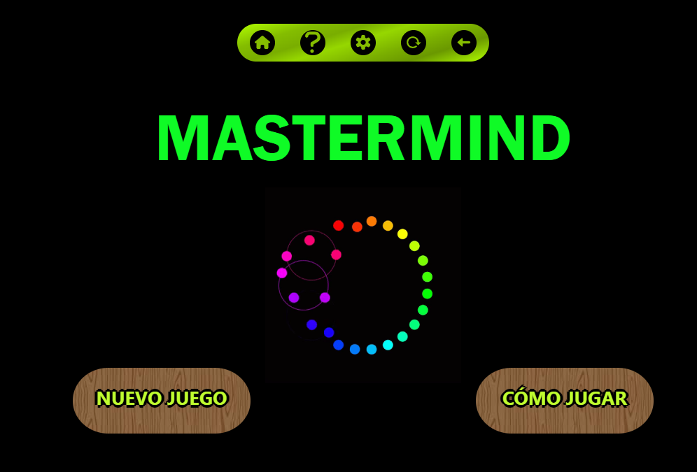
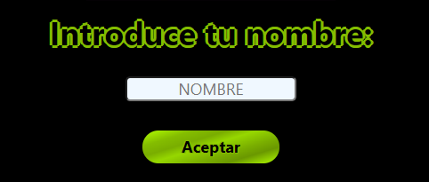
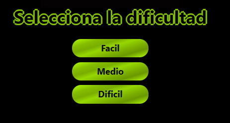
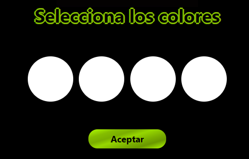
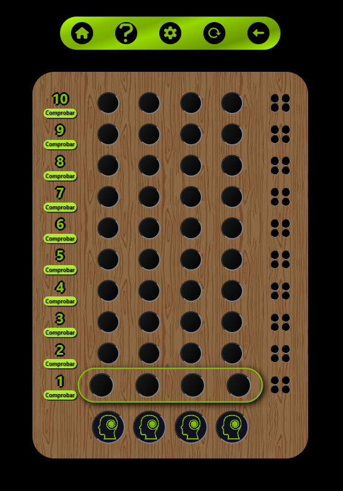
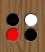

# MasterMind
MasterMind project for GeeksHubs with HTML, CSS, JAVASCRIPT.

## Índice

- [🔵Cómo se hizo🔵](#cómo-se-hizo)
- [🟣Cómo funciona🟣](#cómo-funciona)
- [🟡Errores conocidos🟡](#errores-conocidos)
- [🔴Agradecimientos🔴](#agradecimientos)

### 🔵 Cómo se hizo 🔵

Durante el desarrollo de la gameboy se ha utilizado: HTML para la distribución y composición de los elementos, CSS para el formato y los estilos de los elementos del HTML y Javascript para la interacción y animación.

### 🟣 Cómo funciona 🟣

La web con el juego **🎮Mastermind🎮 - by Redkar Rival** se puede ejecutar en navegadores web 🖥️ y teléfonos moviles 📱 con una visibilidad y funcionalidad optima en ambos dispositivos.

1. Seleccion de jugador:
- Debes selecionar tu nombre o dejar que se genere por defecto.

2. Seleccion de dificultad:
- Debes selecionar la dificultad a la que quieres jugar. Si no seleccionas nada se activa el modo facil por defecto.

3. Seleccion de colores:
- Debes selecionar los colores con los que deseas jugar. Recuerda seleccionar colores de tonos diferenciados para facilitar la jugabilidad. Si no seleccionas nada se activa el modo facil por defecto.

4. ⏯️ Se inicia el juego.:

- Para empezar a jugar, pulsa sobre las casillas resaltadas hasta seleccionar los 4 colores de tu jugada. Una vez hayas seleccionado los 4 colores, pulsa el boton "Comprobar" para revisar la puntuación y continuar el juego.
    - 🚨 Se pintará la puntuacion a la derecha segun los colores y posiciones acertadas y los colores presentes en la combinacion ganadora pero no en la posicion correcta. En la siguiente imagen puedes ver como se puntua: Rojo si aciertas posicion y color, blanco si aciertas solo color pero no posicion. 

    - Si aciertas los 4 colores y las 4 posiciones, habrás ganado.
    - Si no aciertas la combinacion de colores en el número de tiradas disponibles, habrás perdido.
    - Si quieres volver a empezar la partida, puedes pulsar el boton "Recargar" o actualizar la pagina.
    - Si quieres volver a elegir la dificultad, puedes pulsar en el icono del engranaje en el menu superior.

### 🟡 Errores conocidos 🟡

Si detectas algún bug, por favor reportalo a *gbc_bugsreport@rockon.geeks*.

Muchas gracias por tu colaboración.

### 🔴 Agradecimientos 🔴

El creado de este juego agradece ❤️ tu tiempo y tu interes ❤️ en este proyecto. 

Si eres desarrollador y te apasiona el mundo de la programación y te gusta colaboraria en el desarrollo web, de software y/o de videojuegos, puedes ponerte en contacto con nuestro equipo en: *gbc_friendsfamilyandfruits@rockon.geeks*.

